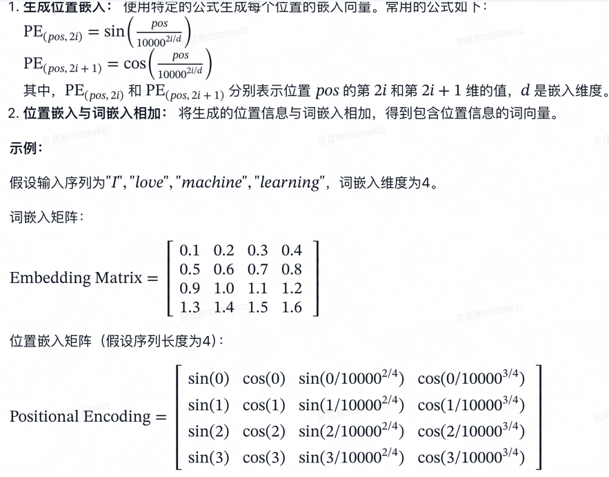

Transformer模型是由Vaswani等人在2017年提出的一种基于注意力机制的深度学习模型，广泛应用于自然语言处理任务，如机器翻译、文本生成等。其核心思想是通过注意力机制捕获输入序列中的依赖关系，而不需要使用传统的循环神经网络（RNN）或卷积神经网络（CNN）。

## 1. Transformer 模型架构

Transformer模型由两个主要部分组成：编码器（Encoder）和解码器（Decoder）。每个部分都由多个相同的层（Layer）堆叠而成。

### 1.1 编码器（Encoder）

编码器层的具体步骤：

输入嵌入：将输入序列中的每个词转换为一个固定维度的向量表示。

位置编码：为了让模型能够**捕获序列中的位置信息**，加入位置编码，使得输入向量包含位置信息。

多头自注意力机制：计算输入序列中每个位置与所有其他位置的依赖关系，得到注意力权重，并加权求和得到新的表示。

残差连接和层归一化：将输入与多头自注意力机制的输出相加，并进行层归一化。

前馈神经网络：对每个位置的表示进行进一步的非线性变换。

再次进行残差连接和层归一化：将前馈神经网络的输出与输入相加，并进行层归一化。

### 1.2 解码器（Decoder）

解码器层的具体步骤：

输入嵌入：将目标序列中的每个词转换为一个固定维度的向量表示。

位置编码：加入位置编码，使得输入向量包含位置信息。

带掩码的多头自注意力机制： 计算目标序列中每个位置与之前位置的依赖关系，得到注意力权重，并加权求和得到新的表示。

残差连接和层归一化： 将输入与带掩码的多头自注意力机制的输出相加，并进行层归一化。

多头注意力机制： 计算目标序列中每个位置与编码器输出的依赖关系，得到注意力权重，并加权求和得到新的表示。

再次进行残差连接和层归一化： 将输入与多头注意力机制的输出相加，并进行层归一化。

前馈神经网络： 对每个位置的表示进行进一步的非线性变换。

再次进行残差连接和层归一化： 将前馈神经网络的输出与输入相加，并进行层归一化。

### 1.3 Transformer 模型的整体流程
输入嵌入和位置编码： 对输入序列和目标序列进行嵌入，并加入位置编码。

编码器： 将输入序列通过多个编码器层，得到编码表示。

解码器： 将目标序列通过多个解码器层，结合编码器的输出，生成目标序列的表示。

生成输出： 将解码器的输出通过线性变换和Softmax函数，生成目标序列的概率分布。

